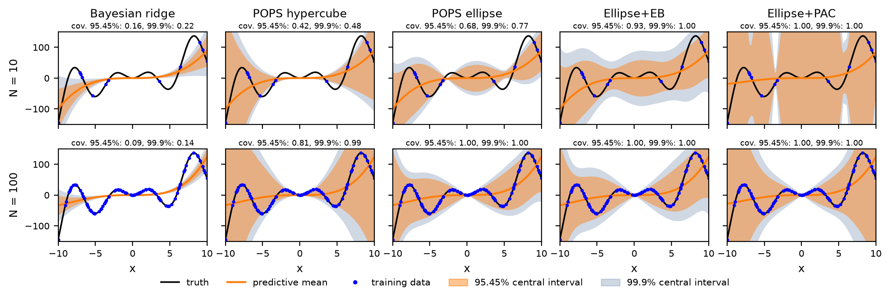

# Example: POPS vs BayesianRidge

A runnable comparison of the three
[`POPSRegression`][popsregression.POPSRegression] posteriors, its PAC-Bayes
layer, and
[`BayesianRidge`](https://scikit-learn.org/stable/modules/generated/sklearn.linear_model.BayesianRidge.html)
on a misspecified, low-noise fit. For why the two differ, see
[Concepts](https://pops-uq.github.io/method/concepts/) on the POPS site; for
the options used here, see [Usage](usage.md).

The full script is available in the repository under
[`examples/example_polynomial.py`](https://github.com/POPS-UQ/popsregression/blob/main/examples/example_polynomial.py).

## A misspecified, low-noise problem

We create a target function that a 4th-degree polynomial cannot perfectly
reproduce. This is the *misspecification*: the model is structurally unable to
capture the true function, regardless of how much data we have.

```python
import numpy as np
from sklearn.preprocessing import PolynomialFeatures

rng = np.random.RandomState(1042)


def target_function(x):
    return (x**3 + 0.01 * x**4) * 0.1 + np.sin(x) * x * 10.0


def generate_data(rng, n_samples):
    x_train = np.sort(
        np.append(rng.uniform(-1, 1, n_samples), np.linspace(-1, 1, 2)) * 10
    )
    x_dense = np.linspace(-10, 10, 201)

    poly = PolynomialFeatures(degree=4, include_bias=True)
    X_train = poly.fit_transform(x_train.reshape(-1, 1))
    X_dense = poly.transform(x_dense.reshape(-1, 1))
    return X_train, target_function(x_train), X_dense, target_function(x_dense)
```

## Fitting at increasing training set sizes

We compare `BayesianRidge` with the three POPS posteriors for `N = 10` and
`N = 100` training points. As `N` increases the `BayesianRidge` epistemic
uncertainty shrinks towards zero, but the POPS misspecification uncertainty
persists because the polynomial is fundamentally unable to fit the target.

```python
from sklearn.linear_model import BayesianRidge

from popsregression import POPSRegression

for n_samples in (10, 100):
    X_train, y_train, X_dense, y_dense = generate_data(rng, n_samples)

    # BayesianRidge: epistemic uncertainty only, excluding the aleatoric alpha_
    bayes = BayesianRidge(fit_intercept=False).fit(X_train, y_train)
    bayes_mean = bayes.predict(X_dense)
    bayes_std = np.sqrt(np.sum((X_dense @ bayes.sigma_) * X_dense, axis=1))

    # POPS: mean, combined std, and min/max posterior bounds
    for model in (
        POPSRegression(minimum_relative_error=0.0, posterior="hypercube"),
        POPSRegression(posterior="ellipsoid", random_state=0),
        POPSRegression(posterior="ellipsoid", pac_bayes=True, random_state=0),
    ):
        model.fit(X_train, y_train)
        mean, std, upper, lower = model.predict(
            X_dense, return_std=True, return_bounds=True
        )
```

Each panel below plots the posterior mean (orange line) against the truth
(black) and the training points (blue). The darker orange band is the 95.45%
interval; the outer grey band is the POPS min/max posterior envelope, or
`±4σ` for `BayesianRidge`. Each panel reports the fraction of the dense truth
curve covered by its outer band.



**Result**

- **N = 10**: every method is wide here, but only POPS is wide in the right
  places. The `BayesianRidge` `±4σ` envelope still covers just 26% of the
  truth, against 43% for the hypercube, 79% for the ellipse and 100% for the
  PAC-Bayes ellipse.
- **N = 100**: the `BayesianRidge` band collapses onto the polynomial and its
  coverage *falls* to 17% — more data has made it more confident and less
  correct, because the residual error is misspecification, not noise. The POPS
  posteriors move the other way, reaching 96% (hypercube) and 100% (both
  ellipses).

For low-noise misspecified models, more data reduces only the *epistemic*
component of the uncertainty; POPS captures the *misspecification* component
that remains.

## Posterior types

`POPSRegression` supports three posterior forms over the pointwise
corrections, all selected with the same `posterior` parameter:

- `'hypercube'` (default): fits a PCA-aligned hypercube to the corrections,
  giving conservative bounds suitable for most use cases.
- `'ensemble'`: uses the raw pointwise corrections directly as posterior
  samples.
- `'ellipsoid'`: fits a uniform ellipsoid by direct optimization, and
  predicts through its exact pushforward rather than through samples (see
  [Ellipsoid posteriors](ellipse.md)). Add the PAC-Bayes layer with
  `pac_bayes=True`.

`minimum_relative_error=0.0` below keeps every training point in the posterior
estimate rather than only those the model fits poorly.

```python
for posterior in ["ensemble", "hypercube"]:
    pops = POPSRegression(
        posterior=posterior,
        resampling_method="uniform",
        resample_density=10.0,
        minimum_relative_error=0.0,
    )
    pops.fit(X_train, y_train)
    y_pred, y_std, y_max, y_min = pops.predict(
        X_dense, return_std=True, return_bounds=True
    )
```
