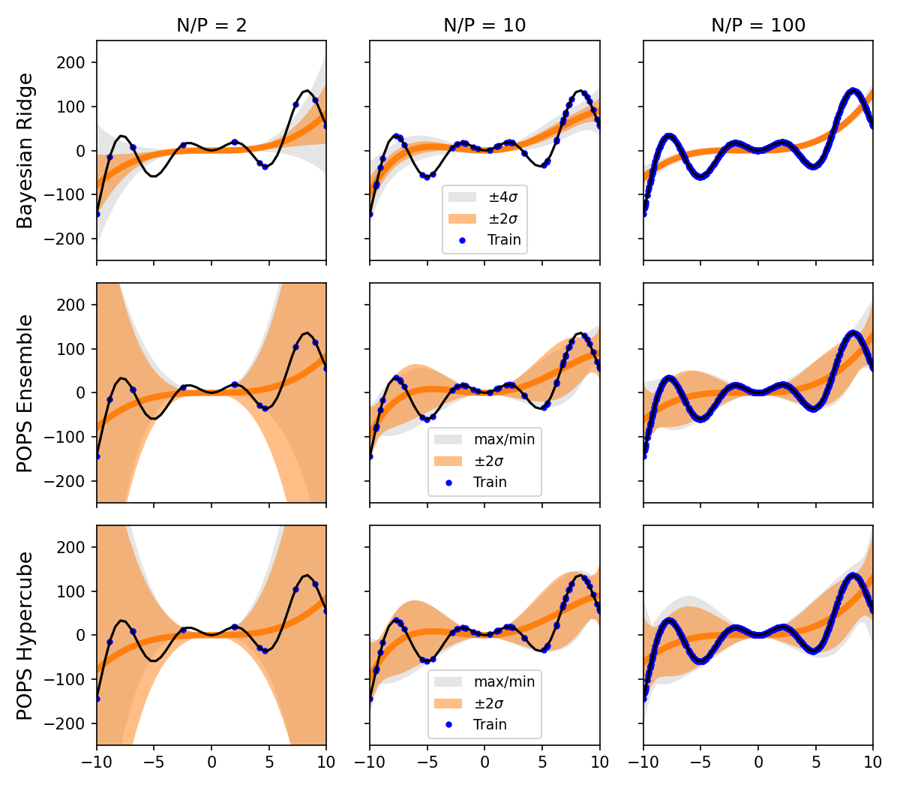

# Example: POPS vs BayesianRidge

A runnable comparison of [`POPSRegression`][popsregression.POPSRegression] and
[`BayesianRidge`](https://scikit-learn.org/stable/modules/generated/sklearn.linear_model.BayesianRidge.html)
on a misspecified, low-noise fit. For why the two differ, see
[Concepts](https://pops-uq.github.io/method/concepts/) on the POPS site; for
the options used here, see [Usage](usage.md).

The full script is available in the repository under
[`examples/plot_pops_regression.py`](https://github.com/POPS-UQ/popsregression/blob/main/examples/plot_pops_regression.py).

## A misspecified, low-noise problem

We create a target function that a 4th-degree polynomial cannot perfectly
reproduce. This is the *misspecification*: the model is structurally unable to
capture the true function, regardless of how much data we have.

```python
import numpy as np

rng = np.random.RandomState(42)


def target_function(x):
    return (x**3 + 0.01 * x**4) * 0.1 + np.sin(x) * x * 10.0


x_test = np.linspace(-11, 11, 200)
y_test = target_function(x_test)
```

## Fitting at increasing training set sizes

We compare `POPSRegression` and `BayesianRidge` for `N = 10, 30, 500` training
points. As `N` increases, the `BayesianRidge` epistemic uncertainty shrinks to
near-zero, but the POPS misspecification uncertainty persists because the
polynomial is fundamentally unable to fit the target.

```python
from sklearn.linear_model import BayesianRidge
from sklearn.preprocessing import PolynomialFeatures

from popsregression import POPSRegression

for n_samples in [10, 30, 500]:
    # Generate training data (no noise — purely deterministic)
    x_train = np.sort(
        np.append(rng.uniform(-1, 1, n_samples), np.linspace(-1, 1, 2)) * 10
    )
    y_train = target_function(x_train)

    poly = PolynomialFeatures(degree=4, include_bias=True)
    X_train = poly.fit_transform(x_train.reshape(-1, 1))
    X_test = poly.fit_transform(x_test.reshape(-1, 1))

    # POPS Regression: mean, combined std, and min/max posterior bounds
    pops = POPSRegression(resampling_method="sobol", resample_density=10.0)
    pops.fit(X_train, y_train)
    y_pred, y_std, y_max, y_min = pops.predict(
        X_test, return_std=True, return_bounds=True
    )

    # BayesianRidge (epistemic uncertainty only, excluding aleatoric alpha_)
    br = BayesianRidge(fit_intercept=False)
    br.fit(X_train, y_train)
    br_pred = br.predict(X_test)
    br_epistemic_std = np.sqrt(np.sum(np.dot(X_test, br.sigma_) * X_test, axis=1))
```

Plotting the POPS `±2σ` band (orange), the POPS min/max envelope (grey), and the
`BayesianRidge` epistemic-only `±2σ` band (green) against the truth (black)
produces the following comparison.



**Result**

- **N = 10**: Both methods show wide uncertainty, but POPS is wider and provides
  better coverage of the true function.
- **N = 30**: The `BayesianRidge` epistemic uncertainty has already shrunk
  significantly, while POPS correctly maintains wider bands where the polynomial
  deviates from the truth.
- **N = 500**: The `BayesianRidge` epistemic uncertainty is nearly invisible,
  yet the polynomial still cannot match the oscillatory target. POPS maintains
  honest uncertainty that reflects this structural limitation.

For low-noise misspecified models, more data reduces only the *epistemic*
component of the uncertainty; POPS captures the *misspecification* component
that remains.

## Posterior types

`POPSRegression` supports two posterior forms over the pointwise corrections:

- `'hypercube'` (default): fits a PCA-aligned hypercube to the corrections,
  giving conservative bounds suitable for most use cases.
- `'ensemble'`: uses the raw pointwise corrections directly as posterior
  samples.

`minimum_relative_error=0.0` below keeps every training point in the posterior
estimate rather than only those the model fits poorly.

```python
for posterior in ["ensemble", "hypercube"]:
    pops = POPSRegression(
        posterior=posterior,
        resampling_method="uniform",
        resample_density=10.0,
        minimum_relative_error=0.0,
    )
    pops.fit(X_train, y_train)
    y_pred, y_std, y_max, y_min = pops.predict(
        X_test, return_std=True, return_bounds=True
    )
```
